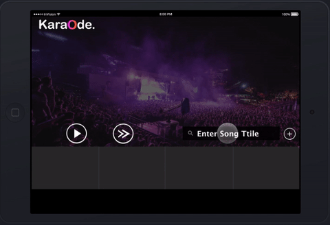
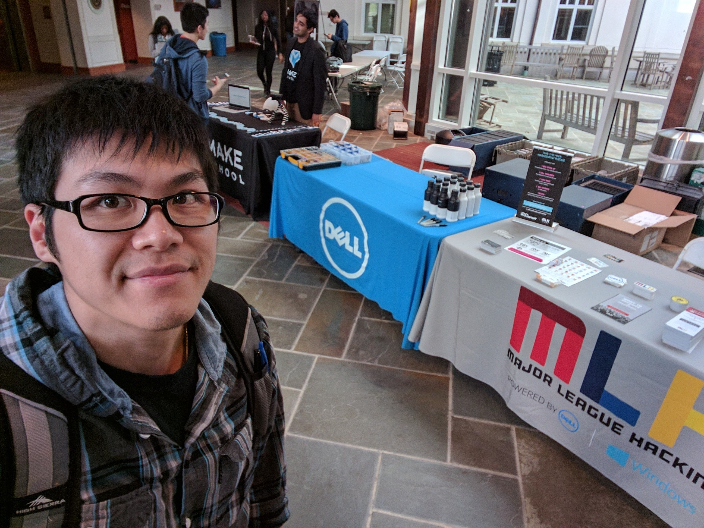
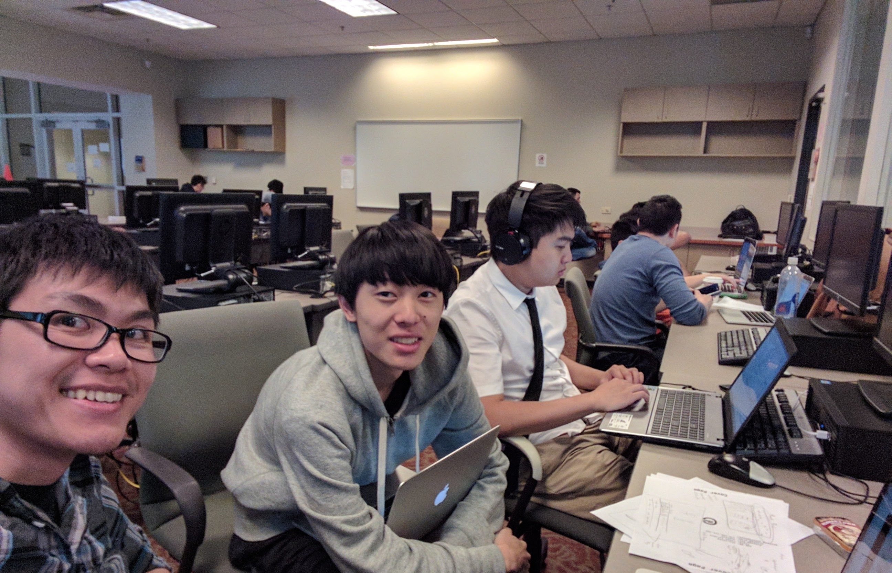
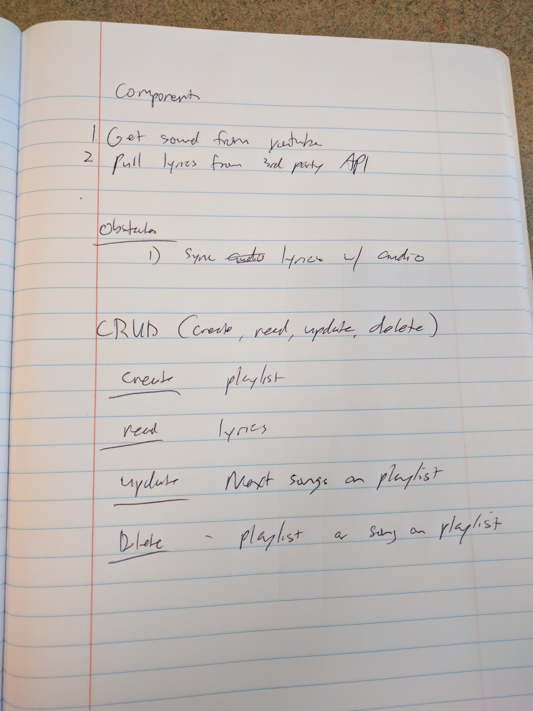
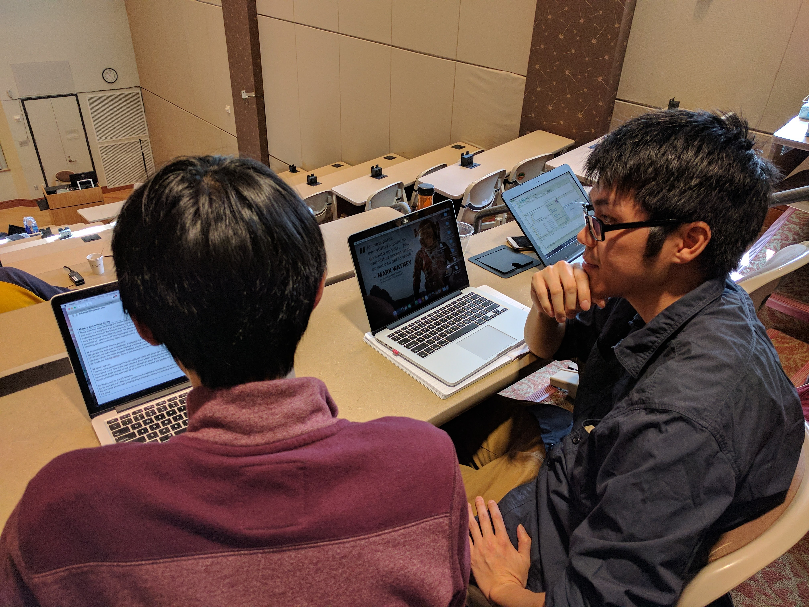
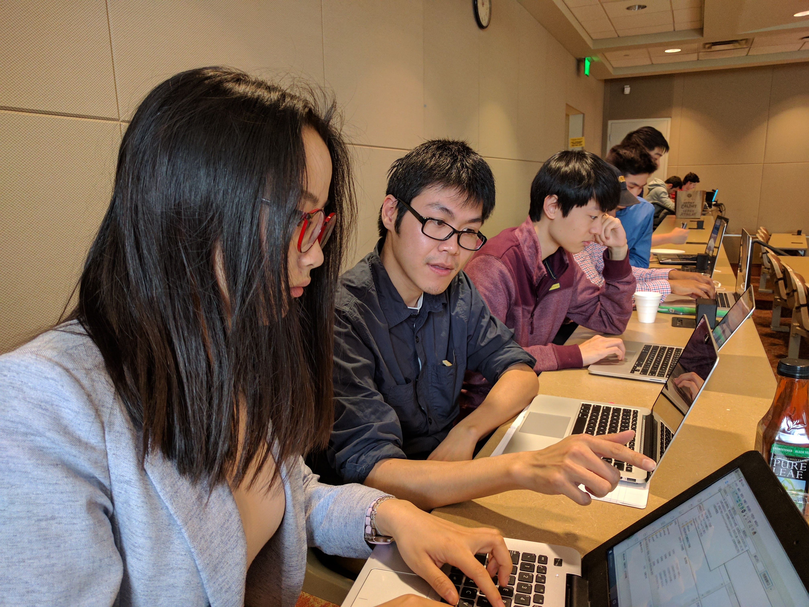
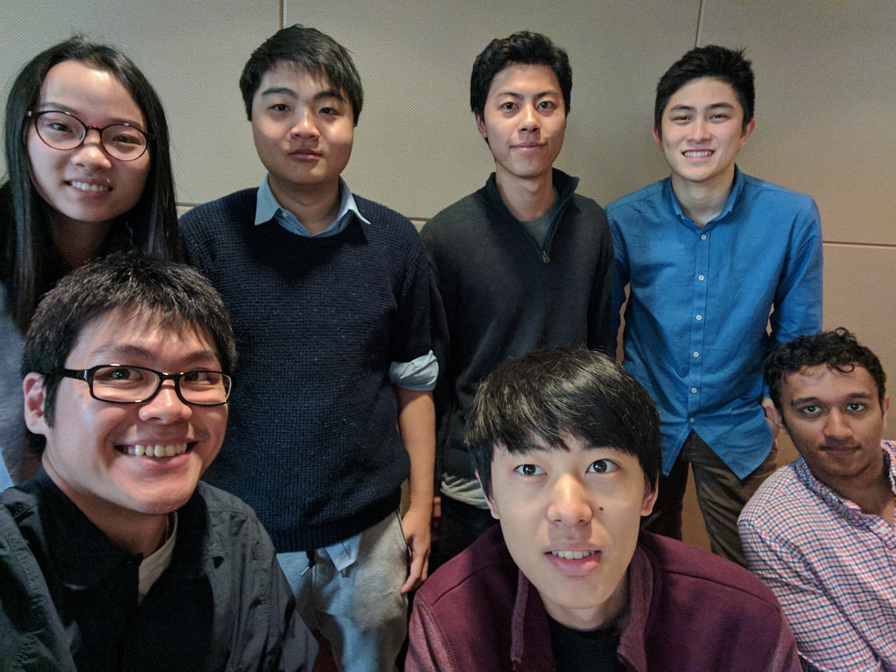

# karaode
Karaoke web app that combines audio from YouTube and displays lyrics to sing along

## INSPIRATION
[
Wanted to make something socially fun for parties. People were very enthusiastic about my idea. When I pitched the idea 12 people wanted to join my team.

## WHAT IT DOES
Users can search for songs from YouTube, then our app rips the vocals and displays lyrics to the songs. Other functionalities are: collect songs in a queue, play songs, pause songs, remove songs from queue.

## HOW THE APP WAS BUILT
[
[
With 24 hours to build our product, the best way to organize our actions in a sort of design sprint for two teams. It was something like:

Design // Development teams
1. Map out overall design // List core functionalities
2. Sketch how frontend should look // Research possible APIs
3. Craft clickable prototype in inVision // Create sandbox environments to test API
4. Build the frontend // Test the APIs
5. Consolidate everything together

Some helpful API's found
* https://developers.google.com/youtube/iframe_api_reference
* http://www.youtubeinmp3.com/api/
* https://developer.musixmatch.com/

## CHALLENGES I RAN INTO
I had the most experience on the team with development and design, so time-management was very tricky to make sure everyone got enough attention and guidance on what to do. With this being a first-time experience for many of my team members, I prioritized that they had fun and learned how to work with the tools rather than exahausting them to solve everything. I emphasized that the most important thing was for them to get exposure to the whole process:

* Game plan
* Design
* Develop
* FTP files into domain.com and devpost
* Documentation

[

## ACCOMPLISHMENTS THAT I'M PROUD OF

I had three roles for the Emory Hackathon:
* Sprint Facilitator / Scrum Master
* UX Designer
* Frontend developer

[

## WHAT I LEARNED
I'm glad I learned full-stack development as it definitely helped with the feasibility of designs and helped prioritize what componenets needed to be made. It also helped me guide my team members on how to best build the project (one sandboxed environment at a time, then combine everything).

[
